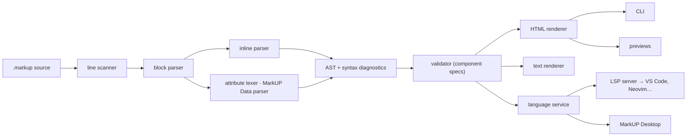

# Architecture

## Packages and their boundaries

| Package | Depends on | Knows about |
|---|---|---|
| `core` | — | syntax, the tree, component **specs**, schemas, diagnostics. Nothing about HTML or editors. |
| `html` | core | turning trees into HTML; the theme; charts; scroll-sync DOM helpers |
| `text` | core | turning trees into plain text |
| `language-service` | core | editor features as plain offsets: completion, hover, outline, folding, highlighting, navigation, fixes |
| `language-server` | core, language-service | the LSP protocol |
| `cli` | core, html, text | files, the terminal, a preview server |
| `vscode` | language-server (bundled), core, html, language-service | the VS Code API, the webview preview |
| `desktop` | core, html, text, language-service | React UI, CodeMirror, Tauri |

Two rules keep this healthy:

1. **The parser never sees a renderer.** It receives a registry of specs (to know content models) and produces a plain, JSON-serialisable tree. Renderers are chosen by the caller.
2. **Language features are written once.** VS Code gets them through LSP; the desktop app calls the same functions in-process. Highlighting in the desktop editor comes from the parser too (no second grammar), so what you see colored is what the parser understood. VS Code keeps a TextMate grammar for instant coloring and refines it with semantic tokens from the same service.

## Parsing

The parser is hand-written, in layers — see [ADR 0001](adr/0001-parser-architecture.md):

- **Line scanner** — splits lines, keeps exact offsets (CRLF, CR, BOM, NUL).
- **Block parser** — a CommonMark-style state machine over lines with a stack of open blocks. Directive containers are fence-delimited containers; their closing rules are in [spec §6.4](spec.md#64-closing-fences). Content models make `data` and `raw` bodies opaque, like code.
- **Inline parser** — a single scan that tokenises and builds nodes in a linked list, resolving emphasis with the CommonMark delimiter stack and links with a bracket stack.
- **Sub-parsers** — attributes (a small lexer), info strings, MarkUP Data (an indentation-based recursive descent parser with positions on every value).
- **Validator** — walks the finished tree, checking specs and document rules.

Every piece reports into one `DiagnosticBag`; every node and diagnostic carries line, column and offset in UTF-16 units, which LSP and CodeMirror use directly.

Robustness is designed in, not bolted on: nesting limits (64 block levels, 32 inline levels, 128 data levels), no recursion on unbounded input in the block parser, iterative tree walks, linear-time algorithms for emphasis and code spans, and property-based tests that parse random documents and check invariants.

## Rendering

`renderHtml(tree, options)` walks the tree and calls a component function per directive. Options add `data-line` attributes (used by both previews for scroll sync), rewrite URLs (the CLI maps `.markup` links to `.html`; previews map images to local file URLs) and plug in a syntax highlighter. Output never contains scripts; URLs are checked with the same `isSafeUrl` rule the validator uses, so warnings match what is dropped.

Charts are rendered to static SVG with an accessible data table; tabs are pure CSS; details are native `
`. A page built by the CLI works without JavaScript.

## Editors

- **VS Code**: the extension host starts the bundled language server over IPC and renders the preview itself (the webview only patches the DOM and reports scrolling). See [vscode.md](vscode.md).
- **Desktop**: one `LanguageService` analyses each document version once; highlighting, lint, completion, the outline, the status bar and the preview all read that analysis. The preview lives in a shadow root and is patched with morphdom. See [desktop.md](desktop.md).

## Decisions

- [0001 Parser architecture](adr/0001-parser-architecture.md)
- [0002 Directive syntax and content models](adr/0002-directives-and-content-models.md)
- [0003 No raw HTML](adr/0003-no-raw-html.md)
- [0004 Desktop stack](adr/0004-desktop-stack.md)
- [0005 A language server](adr/0005-language-server.md)
